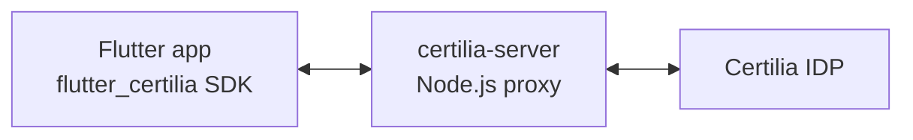
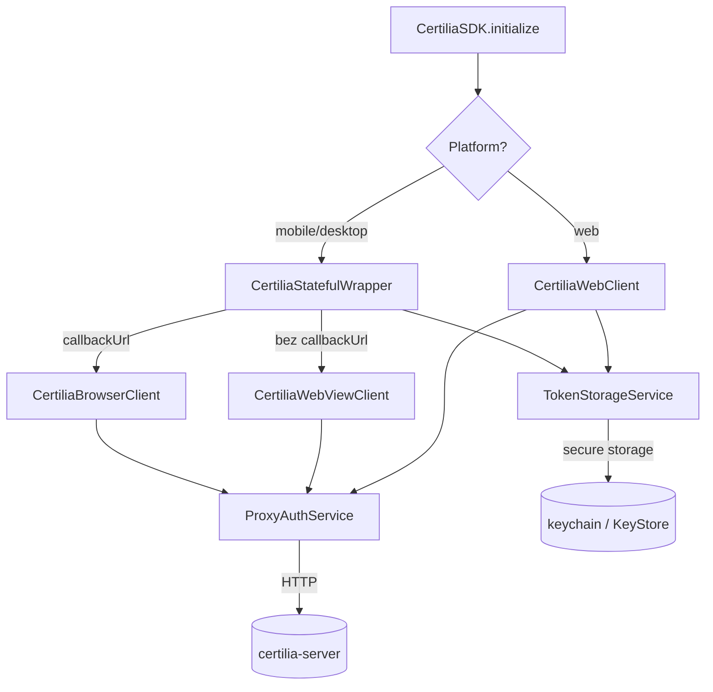

# flutter_certilia — onboarding za Claude

Sažet referent za buduće sesije rada na ovom repu. Ne aspiracije —
samo stvarno stanje koda.

**Verzija:** 0.2.0 · **Datum posljednjeg refaktora:** svibanj 2026 ·
**Licenca:** MIT

## Što ovo radi

Flutter SDK za prijavu hrvatskom elektroničkom osobnom iskaznicom
(eOsobna) preko Certilije / NIAS-a. Normalno komunicira s backend
proxyjem (`certilia-server/` u istom repu) koji drži OAuth credentialse
i razgovara s Certilia IDP-om; u direct modu (`CertiliaDirectClient`)
aplikacija sama drži klijenta i razgovara izravno s Certilijom.



## Što je provjereno o Certiliji (2026-09-26)

Provjereno pravim eID loginima i izravnim pozivima na `idp.certilia.com`
(WSO2 Identity Server):

1. **Code exchange traži client secret.** Certilia izdaje samo
   povjerljive (confidential) klijente: token endpoint bez secreta vraća
   `invalid_client` ("Unsupported Client Authentication Method!"), a
   developer portal ne nudi javni PKCE klijent. Secret drži ili
   `certilia-server`, ili sama aplikacija u direct modu
   (`CertiliaDirectClient`): token endpoint i JWKS dopuštaju
   cross-origin pozive, pa login radi i bez ikakvog servera. U direct
   modu secret je javan; štite exact-match callback i PKCE, zato direct
   mode traži https callback. Implicit (`response_type=id_token`) je za
   portal klijente isključen (`unauthorized_client`).
2. **Jedan callback URL po klijentu, točno podudaranje.** Svaki tok s
   vlastitim callbackom treba vlastiti Certilia klijent; proxy ih bira
   po `redirect_uri` (`CERTILIA_CLIENTS`).
3. **Custom scheme radi na IDP-u, portal ga formalno ne dopušta.**
   Portal piše "Only HTTPS is allowed" i odbija `scheme://...`, ali
   prihvaća `hr.example.app:1/callback` (valjan URI sa shemom
   `hr.example.app`) zbog buga u regexu. IDP ga poštuje: login, exchange
   i refresh rade. Preferiraj https App Link / Universal Link.
4. **`userinfo` nije nepouzdan nego vezan za browser.** Access token je
   vezan za `atbv` cookie koji Certilia postavi u browseru pri loginu;
   poziv sa servera uvijek dobije "Valid token binding value not
   present". Claimove čitamo iz ID tokena (`claims` parametar traži OIB).
5. **`window.opener.postMessage` ne radi pod COOP-om.** Kad app šalje
   `Cross-Origin-Opener-Policy: same-origin`, popup na Certiliji ima
   `window.opener === null`. Callback stranica na originu aplikacije
   zato javlja rezultat preko BroadcastChannela i localStoragea.
6. **Safari (i svi browseri na iOS-u) blokira `window.open` nakon
   mrežnog awaita.** Web klijent otvara prazan popup prije poziva
   proxyju; `authenticate()` se mora zvati izravno iz tap handlera.
7. **Login potvrđuje push u Certilia aplikaciji**, pa WebView, Auth Tab,
   ASWebAuthenticationSession i popup rade jednako; nema prebacivanja
   između aplikacija.
8. **Android: bez `preferEphemeral`.** S njim flutter_web_auth_2 5.x na
   Chromeu < 141 otvara običan Custom Tab koji nakon redirecta ostaje
   iznad aplikacije. `CertiliaBrowserClient` ga šalje samo na iOS-u.
   Provjereno na Android 16 emulatoru (Chrome 133) pravim loginom i
   lažnim proxyjem.
9. **Refresh kod Certilije ne radi** za portal klijente
   (`invalid_grant`, "Persisted access token data not found"), ni sa
   servera ni iz browsera. `/api/auth/refresh` proxyja samo ponovno
   potpisuje svoj JWT i Certiliju ne zove.
10. **Login se gubi ako aplikacija umre usred logina.** Započeti login
    (PKCE verifier, state, nonce; u proxy modu session_id) postoji samo
    u memoriji. Ako Android ubije aplikaciju dok korisnik potvrđuje push
    u Certilia aplikaciji, redirect stiže u novi proces i flutter_web_auth_2
    ga odbacuje. Popravak: hvatati redirect intent pri hladnom startu
    (npr. `app_links`) i čuvati započeti login u secure storageu. Nije
    reproducirano; "Don't keep activities" u developer opcijama to omogućuje.

Stara lista "odbačenih pristupa" iz `REFACTOR_PLAN.md` navodila je
razloge koji nisu bili provjereni; tamo je tablica ažurirana.

## Layout

```
lib/
  flutter_certilia.dart                    # javni exports (jedan entry point)
  src/
    certilia_sdk.dart                      # CertiliaSDK.initialize()
    certilia_sdk_factory.dart              # stub (mobile)
    certilia_sdk_factory_web.dart          # web platform factory
    certilia_native_client.dart            # mobile/desktop: zajednički OAuth tok (exchange, refresh, state)
    certilia_webview_client.dart           # mobile/desktop: WebView flow (bez callbackUrl)
    certilia_browser_client.dart           # mobile: sistemski browser (callbackUrl: custom scheme / App Link)
    certilia_web_client.dart               # web: popup + polling ili popup + callback stranica
    oauth_callback.dart                    # parsiranje callback URL-a, provjera state-a
    certilia_stateful_wrapper.dart         # mobile/desktop: state management
    services/
      certilia_auth_backend.dart           # sučelje: initialize/exchange/refresh/profil
      auth_backend_factory.dart            # proxy ili direct prema konfiguraciji
      proxy_auth_service.dart              # **sve** HTTP komunikacije s proxyjem
      direct_auth_service.dart             # direct mode: Certilia izravno, PKCE, provjera ID tokena
      token_storage_service.dart           # FlutterSecureStorage wrapper
      certilia_logger.dart                 # logging
    models/
      certilia_config.dart                 # konfiguracija
      certilia_direct_client.dart          # client id/secret za direct mode
      certilia_user.dart                   # osnovni profil
      certilia_token.dart                  # access/refresh/ID tokeni
      certilia_extended_info.dart          # puni profil
    exceptions/
      certilia_exception.dart              # hijerarhija iznimaka
example/                                   # demo aplikacija — copy-paste-ready UI
certilia-server/                           # Node.js proxy
test/                                      # unit testovi (46 prolaze)
```

## Javni API

Jedini entry point:

```dart
final certilia = await CertiliaSDK.initialize(serverUrl: '...');
```

Opcionalni `callbackUrl` bira kamo Certilia vraća browser nakon logina
(vidi README, "Login flows"). Bez njega vrijede WebView (mobile) i
popup + polling (web).

Vraćeni objekt ima različit konkretan tip ovisno o platformi
(`CertiliaWebClient` na webu, `CertiliaStatefulWrapper` na mobile/
desktopu), ali metode su iste:

- `authenticate(context) → CertiliaUser`
- `checkAuthenticationStatus() → bool`
- `getCurrentUser() → CertiliaUser?`
- `refreshToken() / refreshToken({accessToken, refreshToken})` (varijanta po klijentu)
- `getExtendedUserInfo() → CertiliaExtendedInfo?`
- `logout()`

Modeli izvezeni: `CertiliaConfig`, `CertiliaUser`, `CertiliaToken`,
`CertiliaExtendedInfo`. Iznimke: `CertiliaException`,
`CertiliaAuthenticationException`, `CertiliaNetworkException`,
`CertiliaConfigurationException`. Deprecated typedef-ovi:
`CertiliaSDKSimple = CertiliaSDK`, `CertiliaConfigSimple = CertiliaConfig`.

## Interna arhitektura



Tri sloja: **entry / orchestration** (SDK, klijenti, wrapper), **shared
services** (HTTP, storage, logger), **platforma-specifični UI**
(WebView, popup). Sve HTTP komunikacije obavezno kroz
`ProxyAuthService`; sva persistencija kroz `TokenStorageService`.

## Tok podataka

### Mobile / desktop (WebView)

1. `CertiliaStatefulWrapper.authenticate(context)` →
2. `CertiliaWebViewClient.authenticate(context)` →
3. `ProxyAuthService.initialize()` → server vraća authorization_url,
   state, session_id
4. WebView pokrene authorization_url; user autenticira preko Certilije
5. WebView detektira callback (`$serverUrl/api/auth/callback`),
   validira `state`, izvuče `code`
6. `ProxyAuthService.exchange(code, state, sessionId)` → tokeni
7. `CertiliaStatefulWrapper` sprema tokene + user u secure storage

### Mobile (sistemski browser, `callbackUrl` postavljen)

1. `CertiliaBrowserClient.authenticate(context)` →
2. `ProxyAuthService.initialize(redirectUri: callbackUrl)`; proxy bira
   Certilia klijenta registriranog za taj callback
3. `flutter_web_auth_2` otvara authorization_url u Auth Tabu / Custom
   Tabu (Android) ili `ASWebAuthenticationSession` (iOS)
4. OS vraća redirect na custom scheme ili App Link; `codeFromCallback`
   provjeri `state` i izvuče `code`
5. `ProxyAuthService.exchange(...)` → tokeni

### Web (popup + callback stranica, `callbackUrl` postavljen)

1. `CertiliaWebClient.authenticate(context)` otvara prazan popup
   odmah, prije ikakvog awaita (Safari)
2. `ProxyAuthService.initialize(redirectUri: callbackUrl)`
3. Popup ide na authorization_url; Certilia ga vraća na
   `certilia_callback.html` na originu aplikacije
4. Stranica šalje callback URL preko BroadcastChannela `certilia_auth`
   i ostavlja ga u localStorageu (`certilia_auth_result`); app ga čita
   i briše, provjeri `state`
5. `ProxyAuthService.exchange(...)` → tokeni

### Web (popup + polling)

1. `CertiliaWebClient.authenticate(context)` → otvori prazan popup
2. `ProxyAuthService.initialize()` → state + session_id
3. `ProxyAuthService.startPollingSession()` → polling_id
4. Popup ide na authorization_url
5. Server obradi callback, sprema rezultat na polling_id
6. Klijent svake 2s `ProxyAuthService.pollStatus(pollingId)` →
   čim status=completed, dohvati code
7. `ProxyAuthService.exchange(code, ...)` → tokeni
8. Popup se sam zatvori

## Endpointi `certilia-server`-a koje SDK koristi

| HTTP | Path | Što radi |
|---|---|---|
| GET | `/api/auth/initialize` | Pokreće OAuth, vraća authorization_url + state + session_id |
| GET | `/api/auth/callback` | Server-side callback (Certilia ga zove) |
| POST | `/api/auth/exchange` | Code → tokeni |
| POST | `/api/auth/refresh` | Refresh tokena (oba tokena u body-ju) |
| POST | `/api/auth/polling/start` | Web: kreira polling sesiju |
| GET | `/api/auth/polling/:id/status` | Web: polling result |
| GET | `/api/auth/user` | Basic user info iz JWT-a |
| GET | `/api/user/extended-info` | Puni profil iz Certilije |

## Konvencije

- Sve HTTP komunikacije idu kroz `CertiliaAuthBackend`
  (`ProxyAuthService` ili `DirectAuthService`). Ne dodaj direktan
  `http.get/post` u klijente — zaobilazi retry/timeout/error policy.
- Sva token persistencija ide kroz `TokenStorageService`. Ne pristupaj
  `FlutterSecureStorage` direktno (cache key konzistentnost).
- Sva logiranja kroz `CertiliaLogger` — gated na `config.enableLogging`.
- Custom HTTP headeri se **ne** šalju na webu — trigaju CORS preflight
  koji server ne dozvoljava. Vidi komentar u
  `ProxyAuthService._baseHeaders`.
- Konstruktori `CertiliaWebClient` i `CertiliaStatefulWrapper`
  pokreću `_initializeTokens()/_initializeState()` u `_ready` future.
  Sve async public metode počinju s `await _ready;` — nemoj to ukloniti
  (race koji se vraćao na svaki hot restart).
- Refresh flow šalje oba tokena u JSON body, ne u Authorization header.
  Server (`authController.refreshToken`) fallback prihvaća header za
  backward compat — nemoj se osloniti na to za nove klijente.

## Razvojni protokol

- **Manualna Chrome verifikacija** nakon svake inkrementalne izmjene
  (vidi memory: `feedback-chrome-verify`). User radi `flutter run -d
  chrome` i prolazi auth flow.
- **Server pokreni paralelno** s `npm run dev:prod` u
  `certilia-server/`. Mora postojati ngrok tunel za auth callback na
  javnoj HTTPS adresi.
- **Testovi:** `flutter test` mora biti zelen prije svakog commita.
  Trenutno 76 testova; ako mijenjaš `ProxyAuthService`, ažuriraj
  `test/services/proxy_auth_service_test.dart`.
- **Commit poruke:** conventional (`feat:`, `fix:`, `refactor:`,
  `docs:`, `test:`, `build:`). Engleski. Kratak naslov, body objašnjava
  **zašto** ne samo što.
- **Sigurne stvari raditi slobodno:** edit, test, lokalni commit.
- **Pitati prije:** push, force push, brisanje grana, mijenjanje
  shared infrastrukture, mijenjanje server endpointa (može pucati
  deploy ako client/server idu out-of-sync).

## Što se s ovim namjerava raditi

Glavni cilj refaktora bio je pripremiti SDK za reuse kao "Login with
Certilia" komponenta u drugoj Flutter aplikaciji. Vidi
`REFACTOR_PLAN.md` za fazni plan i postignuto stanje.

Konkretno: druga aplikacija pulla ovaj repo kao `git:` dep, povezuje
se na isti `certilia-server` proxy, koristi `CertiliaSDK.initialize()`
i copy-paste-a UI iz `example/lib/certilia_auth/` ako treba početni
template.
