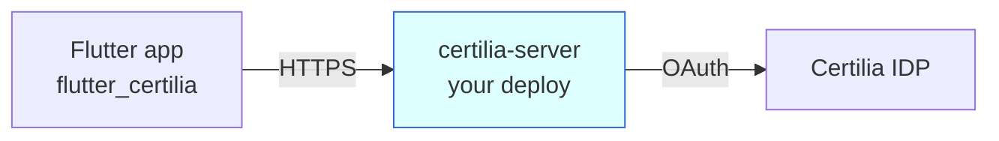

# Deploying `certilia-server`

The Flutter SDK in this repo only works once `certilia-server` is
deployed somewhere reachable. This document covers the recommended
path (Coolify with docker-compose) plus alternatives and one
non-option.



One deployed instance == one Certilia OAuth client. If you have
several apps, deploy several instances (separate Coolify resources,
separate `.env`).

## Recommended: Coolify + docker-compose

[Coolify](https://coolify.io/) is a self-hosted PaaS that runs on
your own VPS. It gives you a git-based deploy flow, environment-
variable UI, automatic Let's Encrypt TLS, and one-click stack
duplication for the multi-app case. The certilia-server repo ships a
docker-compose template that plugs straight in.

### Prerequisites

- A VPS running Docker (Hetzner CX22, DigitalOcean $6 droplet, etc.)
- Coolify installed on it
  ([install guide](https://coolify.io/docs/installation))
- A subdomain pointed at the VPS (e.g. `proxy.your-domain.example`)
- A Certilia OAuth Web Application registered with redirect URI
  `https://proxy.your-domain.example/api/auth/callback`
  ([setup guide](certilia-server/CERTILIA_OAUTH_SETUP.md))

### Steps

1. **In Coolify**: add a new resource → "Docker Compose" → point at
   this repo, branch `main`, base directory `certilia-server/`.

2. **Set environment variables** in Coolify's UI. Copy keys from
   [`certilia-server/.env.example.coolify`](certilia-server/.env.example.coolify)
   and fill in:
   - `CERTILIA_CLIENT_ID`, `CERTILIA_CLIENT_SECRET` (from Certilia
     developer dashboard)
   - `CERTILIA_REDIRECT_URI` = `https://proxy.your-domain.example/api/auth/callback`
   - `JWT_SECRET`, `SESSION_SECRET` = fresh random hex per deploy:
     ```bash
     openssl rand -hex 64
     ```
   - `ALLOWED_ORIGINS` = your Flutter app's origin(s),
     comma-separated, no trailing slash
   - `CERTILIA_BASE_URL` = `https://idp.test.certilia.com` for the
     test environment or `https://idp.certilia.com` for production

3. **Attach the domain** in Coolify → it provisions TLS via Let's
   Encrypt automatically.

4. **Deploy** → Coolify builds the image from `certilia-server/Dockerfile`
   and runs it. Health is `GET /api/health` on the container.

5. **Verify** from your machine:
   ```bash
   curl https://proxy.your-domain.example/api/health
   ```

6. **Point Flutter app** at the new URL:
   ```bash
   flutter run -d chrome \
     --dart-define=CERTILIA_SERVER_URL=https://proxy.your-domain.example
   ```

### Adding another app

Each app gets its own deployed instance:

1. Register a separate OAuth client in Certilia for that app (own
   redirect URI = own subdomain).
2. In Coolify, **duplicate the stack** or add a new Docker Compose
   resource pointing at the same repo/branch.
3. Fill in the new app's env vars (new `CLIENT_ID`,
   `CLIENT_SECRET`, `REDIRECT_URI`, `ALLOWED_ORIGINS`).
4. Attach a different subdomain.

The Flutter app only ever needs to know its own `CERTILIA_SERVER_URL`
— no other coupling.

### Local docker-compose

The same compose file works on a developer machine:

```bash
cd certilia-server
cp .env.example.coolify .env
# fill in real values
docker compose up --build
```

Health check: `curl http://localhost:8080/api/health`.

## Alternative: Google Cloud Run

There's already a [`deploy-cloud-run.sh`](certilia-server/deploy-cloud-run.sh)
script. Cloud Run is managed, scales to zero, and bills only when a
request lands. Tradeoff: cold starts (~1-2s), and managing env vars
through `gcloud` is less ergonomic than a UI.

Quick start:
```bash
cd certilia-server
./deploy-cloud-run.sh
```

Use Cloud Run if you don't want to run a VPS at all.

## Not supported: Cloudflare Pages / Workers

`certilia-server` is a Node.js Express app with in-memory session
state. Cloudflare Pages serves static + Functions (Workers runtime),
which does not run Node.js Express directly. Porting would require:

- Rewriting the framework (Express → Hono or itty-router)
- Replacing the in-memory session `Map` with Workers KV or Durable
  Objects (eventual vs. strong consistency tradeoff)
- Replacing Node-only APIs (`crypto`, `fs`, parts of `http`) with
  Workers equivalents

That's weeks of work for an edge-runtime / zero-cost-free-tier
payoff. Unless that's specifically what you need, Coolify or Cloud
Run will get you to production faster.

## Security checklist before going live

- [ ] `JWT_SECRET` and `SESSION_SECRET` are fresh random values
      (never the example placeholders). Each deploy has its own.
- [ ] `CERTILIA_CLIENT_SECRET` is set via the Coolify UI, **not** in
      a committed `.env` file. Repo's `.gitignore` covers `.env` —
      keep it that way.
- [ ] `ALLOWED_ORIGINS` lists exactly the Flutter app origins you
      want. No wildcards.
- [ ] HTTPS is enforced end-to-end (Certilia rejects HTTP redirect
      URIs).
- [ ] Rate limiting (`RATE_LIMIT_*`) is left enabled.
- [ ] The committed `.env.example.production` file in this repo
      currently contains placeholder-looking but suspiciously real
      Certilia credentials from earlier development. Treat as
      compromised: rotate the corresponding Certilia OAuth
      application's secret in the developer dashboard before going
      live, even if those values were never your production ones.
