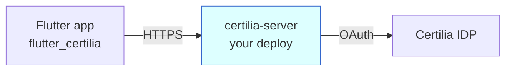

# Deploying `certilia-server`

In proxy mode, the default, the Flutter SDK needs `certilia-server`
deployed where the app can reach it. (Direct mode needs no server; see
the [README](README.md#direct-mode-no-server).) This document covers
Coolify with docker-compose, which is the recommended setup, Google
Cloud Run, and why Cloudflare Pages / Workers cannot run the server.


```mermaid
flowchart LR
    A[Flutter app<br/>flutter_certilia] -->|HTTPS| B[certilia-server<br/>your deploy]
    B -->|OAuth| C[Certilia IDP]
    style B fill:#dff,stroke:#36c
```

Each deployed instance has a default Certilia client and, in
`CERTILIA_CLIENTS`, one more client for each callback URL the apps
receive themselves (see [`certilia-server/README.md`](certilia-server/README.md)).
For several apps, the simplest setup is one instance per app, with
separate Coolify resources and separate `.env` files.

## Recommended: Coolify + docker-compose

[Coolify](https://coolify.io/) is a self-hosted PaaS that runs on
your own VPS. It deploys from git, has a UI for environment variables,
gets TLS certificates from Let's Encrypt, and can duplicate a stack for
a second app. `certilia-server/docker-compose.yml` works in it as is.

### Prerequisites

- A VPS running Docker (Hetzner CX22, DigitalOcean $6 droplet, etc.)
- Coolify installed on it
  ([install guide](https://coolify.io/docs/installation))
- A subdomain pointed at the VPS (e.g. `proxy.your-domain.example`)
- A Certilia OAuth Web Application registered with redirect URI
  `https://proxy.your-domain.example/api/auth/callback`
  ([setup guide](certilia-server/CERTILIA_OAUTH_SETUP.md))

### Steps

1. **In Coolify**: add a new resource → "Docker Compose" → point at
   this repo, branch `main`, base directory `certilia-server/`.

2. **Set environment variables** in Coolify's UI. Copy keys from
   [`certilia-server/.env.example.coolify`](certilia-server/.env.example.coolify)
   and fill in:
   - `CERTILIA_CLIENT_ID`, `CERTILIA_CLIENT_SECRET` (from Certilia
     developer dashboard)
   - `CERTILIA_REDIRECT_URI` = `https://proxy.your-domain.example/api/auth/callback`
   - `JWT_SECRET`, `SESSION_SECRET` = fresh random hex per deploy:
     ```bash
     openssl rand -hex 64
     ```
   - `ALLOWED_ORIGINS` = your Flutter app's origin(s),
     comma-separated, no trailing slash
   - `CERTILIA_BASE_URL` = `https://idp.test.certilia.com` for the
     test environment or `https://idp.certilia.com` for production
   - `CERTILIA_CLIENTS` (optional): the Certilia clients for callbacks
     the app receives itself, such as a web callback page or an App Link

3. **Attach the domain** in Coolify. Coolify gets its TLS certificate
   from Let's Encrypt.

4. **Deploy.** Coolify builds the image from `certilia-server/Dockerfile`
   and runs it. The health check is `GET /api/health`.

5. **Verify** from your machine:
   ```bash
   curl https://proxy.your-domain.example/api/health
   ```

6. **Point the Flutter app** at the new URL:
   ```bash
   flutter run -d chrome \
     --dart-define=CERTILIA_SERVER_URL=https://proxy.your-domain.example
   ```

### Adding another app

Each app gets its own deployed instance:

1. Register a separate OAuth client in Certilia for that app (own
   redirect URI = own subdomain).
2. In Coolify, **duplicate the stack** or add a new Docker Compose
   resource pointing at the same repo/branch.
3. Fill in the new app's env vars (new `CLIENT_ID`,
   `CLIENT_SECRET`, `REDIRECT_URI`, `ALLOWED_ORIGINS`).
4. Attach a different subdomain.

The Flutter app only ever needs to know its own `CERTILIA_SERVER_URL`
and nothing else about the deployment.

### Local docker-compose

The same compose file works on a developer machine:

```bash
cd certilia-server
cp .env.example.coolify .env
# fill in real values
docker compose up --build
```

Health check: `curl http://localhost:8080/api/health`.

## Alternative: Google Cloud Run

[`deploy-cloud-run.sh`](certilia-server/deploy-cloud-run.sh) deploys
the server to Cloud Run, which scales to zero and bills only for
requests. The costs are cold starts of about 1-2 s and setting
environment variables through `gcloud` instead of a UI.

`certilia-server` keeps login sessions in memory. A login fails with
"Invalid or expired session" when `/api/auth/initialize` and
`/api/auth/exchange` reach different instances, or when the instance
scales to zero in between. The script allows up to 10 instances
(`--max-instances 10`), so this can happen as soon as Cloud Run starts
a second one.

To deploy:
```bash
cd certilia-server
./deploy-cloud-run.sh
```

Cloud Run suits you if you do not want to run a VPS.

## Not supported: Cloudflare Pages / Workers

`certilia-server` is a Node.js Express app with in-memory session
state. Cloudflare Pages serves static + Functions (Workers runtime),
which does not run Node.js Express directly. Porting would require:

- Rewriting the framework (Express → Hono or itty-router)
- Replacing the in-memory session `Map` with Durable Objects, or with
  Workers KV, which is only eventually consistent, so a session written
  at `/api/auth/initialize` may not yet be readable at
  `/api/auth/exchange`
- Replacing Node-only APIs (`crypto`, `fs`, parts of `http`) with
  Workers equivalents

That is weeks of work, and the gain is running on Cloudflare's edge
and free tier.

## Security checklist before going live

- [ ] `JWT_SECRET` and `SESSION_SECRET` are fresh random values
      (never the example placeholders). Each deploy has its own.
- [ ] `CERTILIA_CLIENT_SECRET` is set via the Coolify UI, **not** in
      a committed `.env` file. Repo's `.gitignore` covers `.env`;
      keep it that way.
- [ ] `ALLOWED_ORIGINS` lists exactly the Flutter app origins you
      want. No wildcards.
- [ ] The proxy is reachable only over HTTPS. (The Certilia portal
      accepts only https callback URLs.)
- [ ] Rate limiting (`RATE_LIMIT_*`) is left enabled.
- [ ] `.env.example.production` in this repo contains a Certilia
      client ID and secret that look real. Treat them as leaked: if
      that client is yours, rotate its secret in the Certilia
      developer dashboard.
