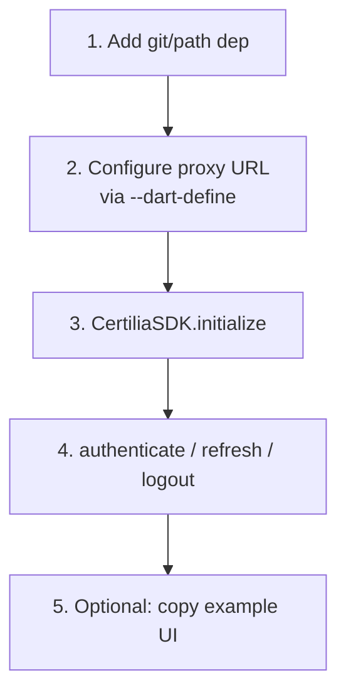

# Adding `flutter_certilia` to another app

Five steps from a new Flutter project to a working "Login with
Certilia" button in proxy mode. They assume a running `certilia-server`
(see [`certilia-server/README.md`](certilia-server/README.md)). For
direct mode, which needs no server, see the
[README](README.md#direct-mode-no-server).



## 1. Add the dependency

In your app's `pubspec.yaml`:

```yaml
dependencies:
  flutter_certilia:
    git:
      url: https://github.com/stepanic/flutter_certilia.git
      ref: main
```

For local development, `path:` works too:

```yaml
dependencies:
  flutter_certilia:
    path: ../flutter_certilia
```

Requirements: Dart `>=3.2.0`, Flutter `>=3.16.0`.

## 2. Configure the proxy URL

The SDK only needs the URL of your `certilia-server`. Read it from
`--dart-define` instead of writing it into the source:

```dart
const _serverUrl = String.fromEnvironment(
  'CERTILIA_SERVER_URL',
  defaultValue: 'https://your-default.example',
);
```

Override per build:

```bash
flutter run --dart-define=CERTILIA_SERVER_URL=https://your-proxy.example
flutter build apk --dart-define=CERTILIA_SERVER_URL=https://prod-proxy.example
```

## 3. Initialize and authenticate

```dart
import 'package:flutter/material.dart';
import 'package:flutter_certilia/flutter_certilia.dart';

class LoginScreen extends StatefulWidget {
  const LoginScreen({super.key});
  @override State<LoginScreen> createState() => _LoginScreenState();
}

class _LoginScreenState extends State<LoginScreen> {
  dynamic _certilia;
  CertiliaUser? _user;

  @override
  void initState() {
    super.initState();
    _init();
  }

  Future<void> _init() async {
    _certilia = await CertiliaSDK.initialize(
      serverUrl: _serverUrl,
      scopes: const ['openid', 'profile', 'eid', 'email', 'offline_access'],
      enableLogging: true,
    );
    final user = await _certilia.getCurrentUser();
    if (mounted) setState(() => _user = user);
  }

  Future<void> _login() async {
    try {
      final user = await _certilia.authenticate(context);
      setState(() => _user = user);
    } on CertiliaAuthenticationException {
      // The user cancelled, or Certilia or the proxy refused the login
    } on CertiliaNetworkException catch (e) {
      // HTTP error reaching the proxy: show e.statusCode / e.message
    }
  }

  Future<void> _logout() async {
    await _certilia.logout();
    setState(() => _user = null);
  }

  @override
  Widget build(BuildContext context) {
    if (_user == null) {
      return Center(
        child: ElevatedButton(
          onPressed: _login,
          child: const Text('Login with Certilia'),
        ),
      );
    }
    return Center(
      child: Column(
        mainAxisSize: MainAxisSize.min,
        children: [
          Text('Hello, ${_user!.fullName ?? _user!.sub}'),
          if (_user!.oib != null) Text('OIB: ${_user!.oib}'),
          ElevatedButton(onPressed: _logout, child: const Text('Logout')),
        ],
      ),
    );
  }
}
```

## 4. Wire it into your app

```dart
void main() => runApp(const MaterialApp(home: LoginScreen()));
```

Without a `callbackUrl`, the SDK opens a popup on web and pushes a
full-screen `WebView` route on mobile and desktop. Both close when the
login finishes, and `authenticate` returns the user.

## 5. (Optional) Use the example UI as a starting point

`example/lib/certilia_auth/` in this repo has a larger UI: a login
button with Certilia's artwork, a logged-in view with user info cards,
a language toggle, and a card that lists every extended field Certilia
returned. Copy the parts you need.

It is outside `lib/`, so it is not part of the package and does not
impose a design on your app.

## Troubleshooting checklist

- **The login button does nothing**: check that the proxy URL opens
  in the browser or on the device.
- **CORS errors on web**: add your app's origin to the proxy's
  `ALLOWED_ORIGINS`. The SDK sends no custom headers from web, so the
  origin is the only thing the proxy has to allow.
- **"Popup blocked"**: the browser refused the popup. Call
  `authenticate()` directly in the tap handler, and allow popups for
  your origin.
- **"Authentication was cancelled"**: the user closed the popup or
  WebView before finishing.
- **`refreshToken` fails with 400**: the proxy is older than 0.2.0 and
  reads the refresh token only from the `Authorization` header, while
  the SDK sends both tokens in the JSON body. Update `certilia-server`;
  since 0.2.0 it accepts both.

See [`README.md`](README.md) for the public API and
[`CLAUDE.md`](CLAUDE.md) for the SDK's internal architecture.
