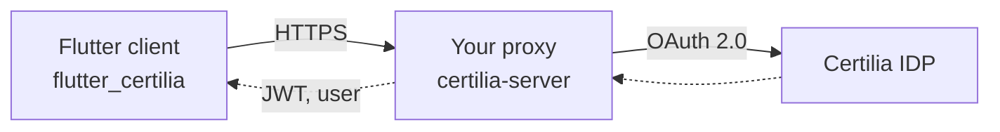
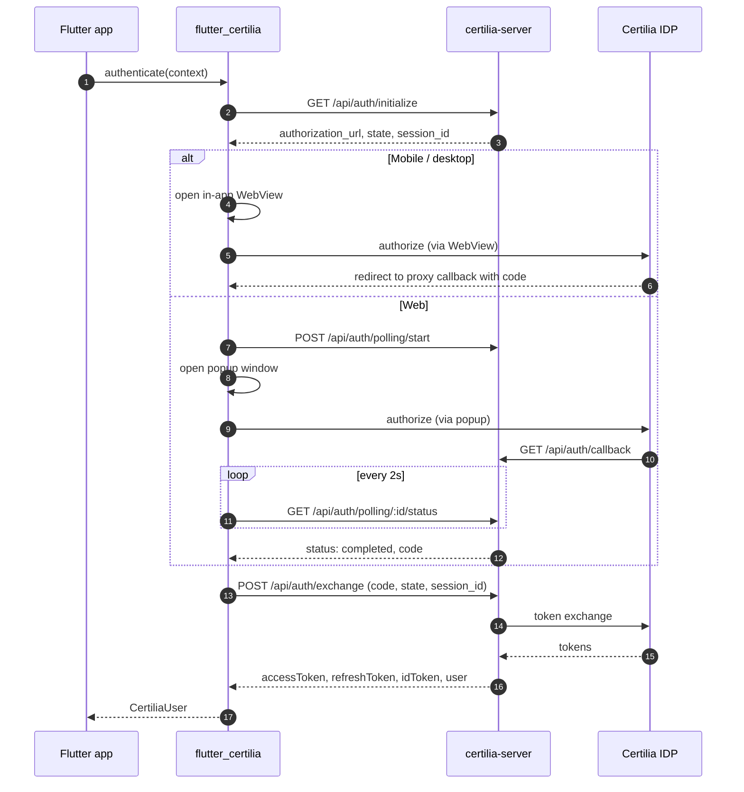

# flutter_certilia

[](https://pub.dev/packages/flutter_certilia)
[](https://opensource.org/licenses/MIT)

Flutter SDK for authenticating Croatian users with their electronic ID
card (eOsobna) via Certilia / NIAS. Works on iOS, Android, and Web.

Flutter SDK za autentifikaciju hrvatskih korisnika preko elektroničke
osobne iskaznice (eOsobna) kroz Certiliju / NIAS. Radi na iOS-u, Androidu
i Webu.

## Architecture

The SDK is **proxy-only**. The Flutter client never talks to Certilia
directly — all OAuth communication is mediated by a backend
(`certilia-server`, included in this repo) that holds the OAuth
credentials.



Direct integration was tried and abandoned — Certilia rejects custom
URL schemes (blocking AppAuth on mobile) and Certilia's `userinfo`
endpoint requires server-side fallbacks to be reliable in production.
See [`REFACTOR_PLAN.md`](REFACTOR_PLAN.md) for the full history.

The auth flow differs slightly by platform:



## Installation

The 0.2.0 line is not yet on pub.dev. Use a `git:` or `path:` dep:

```yaml
dependencies:
  flutter_certilia:
    git:
      url: https://github.com/stepanic/flutter_certilia.git
      ref: main
```

```yaml
dependencies:
  flutter_certilia:
    path: ../flutter_certilia
```

Requirements: Dart `>=3.2.0`, Flutter `>=3.16.0`.

## Usage

The SDK has one entry point. The proxy URL is the only required value
— everything else is sensible defaults you can override.

```dart
import 'package:flutter_certilia/flutter_certilia.dart';

final certilia = await CertiliaSDK.initialize(
  serverUrl: const String.fromEnvironment(
    'CERTILIA_SERVER_URL',
    defaultValue: 'https://your-proxy.example',
  ),
  scopes: const ['openid', 'profile', 'eid', 'email', 'offline_access'],
  enableLogging: true,
);
```

Drive the auth flow. The runtime type returned by `initialize` differs
between web and mobile, but the methods you'll call are the same:

```dart
final user = await certilia.authenticate(context); // popup / WebView
final isAuthed = await certilia.checkAuthenticationStatus();
final extended = await certilia.getExtendedUserInfo();
await certilia.refreshToken();
await certilia.logout();
```

Override the proxy URL per build without touching code:

```bash
flutter run --dart-define=CERTILIA_SERVER_URL=https://your-proxy.example
```

### UI

`flutter_certilia` ships **API-only**. There are no opinionated widgets
or themes — your app keeps full control of its design system.
[`example/lib/certilia_auth/`](example/lib/certilia_auth/) is a working
reference UI (login button, authenticated view, user-info cards, theme
toggle) that you can copy-paste and adapt.

## Public API

| Symbol | Purpose |
|---|---|
| `CertiliaSDK.initialize(...)` | Build a platform-appropriate client |
| `CertiliaConfig` | Configuration object (proxy URL, scopes, logging) |
| `CertiliaUser` | Basic user profile (`sub`, `firstName`, `lastName`, `oib`, `email`, ...) |
| `CertiliaToken` | Access/refresh/ID tokens + expiry helpers |
| `CertiliaExtendedInfo` | Full Certilia profile — any field the upstream returned |
| `CertiliaException` | Base exception; subclasses below |
| `CertiliaAuthenticationException` | OAuth flow failed |
| `CertiliaNetworkException` | HTTP-level failure with `statusCode` |
| `CertiliaConfigurationException` | Misconfigured SDK |

Deprecated typedefs (`CertiliaSDKSimple`, `CertiliaConfigSimple`) are
kept for one minor release; they map directly to the new names and
will be removed in 1.0.0.

## Error handling

```dart
try {
  await certilia.authenticate(context);
} on CertiliaAuthenticationException catch (e) {
  // User cancelled or upstream rejected the flow
} on CertiliaNetworkException catch (e) {
  // HTTP error reaching the proxy
  print('Proxy returned ${e.statusCode}: ${e.message}');
} on CertiliaConfigurationException catch (e) {
  // SDK misconfigured
}
```

## Platform notes

- **iOS, Android**: no scheme-registration needed — auth happens in an
  in-app `WebView`, and the proxy's HTTPS callback is what closes the
  loop, not a custom URL scheme.
- **Web**: opens a popup against the proxy. The proxy's CORS config
  must allow your origin. The SDK does **not** send custom request
  headers from web for this reason (custom headers trigger preflight).
- **Desktop**: `webview_flutter` does not ship a desktop backend; the
  SDK isn't tested on macOS/Windows/Linux. Add the appropriate
  platform plugin if you need it.

The `certilia-server` proxy that the SDK talks to is in this repo at
[`certilia-server/`](certilia-server/) — see its README for setup,
environment variables, and the supported endpoint contract.

## Troubleshooting

- **"Authentication was cancelled"** — popup blocked on web (allow
  popups for your origin) or user closed the WebView. Check
  DevTools console / device logs.
- **`CertiliaNetworkException` on `/api/auth/initialize`** — the
  proxy URL is wrong, the proxy is down, or CORS is blocking your
  origin. `enableLogging: true` plus the browser network tab will
  point at the actual failing request.
- **Logged in but `getCurrentUser()` returns null right after hot
  restart** — was a real bug pre-0.2.0; the constructor's init
  future is now awaited before any public method runs. If you still
  see it, file an issue.

## Contributing

1. Fork the repository
2. Create your feature branch (`git checkout -b feature/amazing-feature`)
3. Commit your changes (`git commit -m 'Add some amazing feature'`)
4. Push to the branch (`git push origin feature/amazing-feature`)
5. Open a Pull Request

## License

MIT — see [LICENSE](LICENSE).

## Support

[GitHub issue tracker](https://github.com/stepanic/flutter_certilia/issues).
