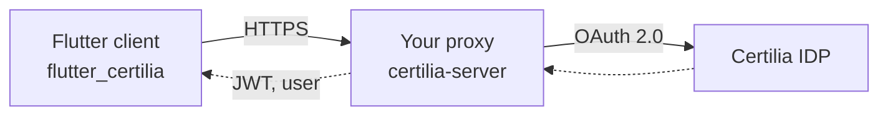
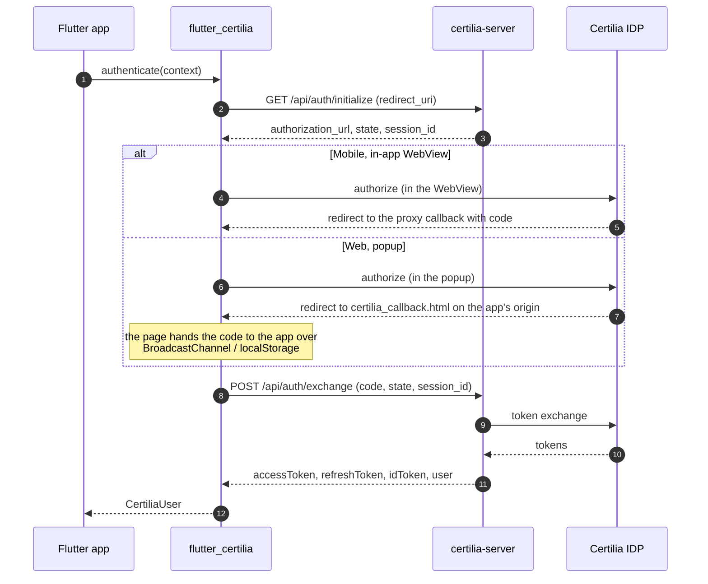

# flutter_certilia

[](https://pub.dev/packages/flutter_certilia)
[](https://opensource.org/licenses/MIT)

Flutter SDK for authenticating Croatian users with their electronic ID
card (eOsobna) via Certilia / NIAS. Works on iOS, Android, and Web.

Flutter SDK za autentifikaciju hrvatskih korisnika preko elektroničke
osobne iskaznice (eOsobna) kroz Certiliju / NIAS. Radi na iOS-u, Androidu
i Webu.

## Architecture

Certilia only issues confidential clients: its token endpoint answers
`invalid_client` ("Unsupported Client Authentication Method!") to a code
exchange without the client secret, and the developer portal offers no
public (PKCE-only) client. Something has to hold that secret. By default
it is `certilia-server`, the proxy in this repo, and the Flutter app
talks only to the proxy:


```mermaid
flowchart LR
    A[Flutter client<br/>flutter_certilia] -->|HTTPS| B[Your proxy<br/>certilia-server]
    B -->|OAuth 2.0| C[Certilia IDP]
    C -.-> B
    B -.->|JWT, user| A
```

In [direct mode](#direct-mode-no-server) the app holds the client
itself and talks to Certilia without a server. In both modes the app can
receive the login redirect itself; see [Login flows](#login-flows).

In proxy mode the login runs like this. On mobile without a `callbackUrl`
an in-app WebView watches for the proxy's callback; on web the popup
returns to a callback page on the app's own origin (see
[Login flows](#login-flows)):


```mermaid
sequenceDiagram
    autonumber
    participant App as Flutter app
    participant SDK as flutter_certilia
    participant Proxy as certilia-server
    participant IDP as Certilia IDP

    App->>SDK: authenticate(context)
    SDK->>Proxy: GET /api/auth/initialize (redirect_uri)
    Proxy-->>SDK: authorization_url, state, session_id

    alt Mobile, in-app WebView
        SDK->>IDP: authorize (in the WebView)
        IDP-->>SDK: redirect to the proxy callback with code
    else Web, popup
        SDK->>IDP: authorize (in the popup)
        IDP-->>SDK: redirect to certilia_callback.html on the app's origin
        Note over SDK: the page hands the code to the app over<br/>BroadcastChannel / localStorage
    end

    SDK->>Proxy: POST /api/auth/exchange (code, state, session_id)
    Proxy->>IDP: token exchange
    IDP-->>Proxy: tokens
    Proxy-->>SDK: accessToken, refreshToken, idToken, user
    SDK-->>App: CertiliaUser
```

## Installation

Version 0.2.0 is not on pub.dev yet. Use a `git:` or `path:` dependency:

```yaml
dependencies:
  flutter_certilia:
    git:
      url: https://github.com/stepanic/flutter_certilia.git
      ref: main
```

```yaml
dependencies:
  flutter_certilia:
    path: ../flutter_certilia
```

Requirements: Dart `>=3.2.0`, Flutter `>=3.16.0`.

## Usage

The SDK has one entry point. In proxy mode the proxy URL is the only
required parameter; the others have defaults.

```dart
import 'package:flutter_certilia/flutter_certilia.dart';

final certilia = await CertiliaSDK.initialize(
  serverUrl: const String.fromEnvironment(
    'CERTILIA_SERVER_URL',
    defaultValue: 'https://your-proxy.example',
  ),
  scopes: const ['openid', 'profile', 'eid', 'email', 'offline_access'],
  enableLogging: true,
);
```

`initialize` returns a different type on web and on mobile, with the
same methods:

```dart
final user = await certilia.authenticate(context); // popup / WebView
final isAuthed = await certilia.checkAuthenticationStatus();
final extended = await certilia.getExtendedUserInfo();
await certilia.refreshToken();
await certilia.logout();
```

Override the proxy URL per build without touching code:

```bash
flutter run --dart-define=CERTILIA_SERVER_URL=https://your-proxy.example
```

### UI

`flutter_certilia` contains no widgets or themes, so the login screen is
built with your app's own design.
[`example/lib/certilia_auth/`](example/lib/certilia_auth/) is a working
UI (login button, logged-in view, user info cards, theme toggle) to copy
and adapt.

## Login flows

`CertiliaSDK.initialize(callbackUrl: ...)` chooses where Certilia sends
the browser after login. Certilia registers exactly **one callback URL
per client** and compares it exactly, so every flow with its own
callback needs its own Certilia client. In proxy mode the proxy must
know each of them (`CERTILIA_CLIENTS`, see
[`certilia-server/README.md`](certilia-server/README.md)) and exchanges
the code; in direct mode the app exchanges it with Certilia.

| `callbackUrl` | Mobile | Web |
|---|---|---|
| `null` (default) | In-app WebView watches for the proxy's `/api/auth/callback` | Not allowed: web requires a callback page |
| Custom scheme, e.g. `hr.example.app:1/callback` | System browser (Android Auth Tab / Custom Tabs, iOS `ASWebAuthenticationSession`); the OS returns the redirect | n/a |
| https App Link / Universal Link | Same as above, redirect verified through `assetlinks.json` / `apple-app-site-association` | n/a |
| https page on the app's own origin, e.g. `https://app.example/certilia_callback.html` | n/a | Popup; [`certilia_callback.html`](example/web/certilia_callback.html) hands the result to the app over BroadcastChannel and localStorage |

One https URL can serve as both the web callback page and the Android
App Link, so a single Certilia client covers both.

### Web

- Copy [`example/web/certilia_callback.html`](example/web/certilia_callback.html)
  into your app's `web/` folder and register its full URL as the
  client's callback.
- Call `authenticate()` directly in the button's tap handler, with no
  network await before it. Safari (and every browser on iOS) blocks
  `window.open` once the page has waited on the network after the tap;
  the SDK opens the popup blank first for this reason.
- The flow works when the app page sends
  `Cross-Origin-Opener-Policy: same-origin`: the callback page does not
  use `window.opener`, which COOP cuts as soon as the popup reaches
  Certilia.
- The code comes back only to the browser that logged in, on your app's
  origin. That is what makes a popup login safe: if someone else starts a
  login and sends the user the Certilia link, the code still lands in the
  user's own browser, where the other party cannot read it. Do not deliver
  the code anywhere else, for example through a proxy endpoint the app
  polls: whoever polls would receive it, including a party that started
  the login in order to collect another user's code.

### Android

Add `flutter_web_auth_2`'s callback activity to `AndroidManifest.xml`
with an intent filter for your callback; the example app has both
variants:

```xml
<activity
    android:name="com.linusu.flutter_web_auth_2.CallbackActivity"
    android:exported="true"
    android:taskAffinity="">
  <!-- custom scheme -->
  <intent-filter>
    <action android:name="android.intent.action.VIEW" />
    <category android:name="android.intent.category.DEFAULT" />
    <category android:name="android.intent.category.BROWSABLE" />
    <data android:scheme="hr.example.app" />
  </intent-filter>
  <!-- https App Link -->
  <intent-filter android:autoVerify="true">
    <action android:name="android.intent.action.VIEW" />
    <category android:name="android.intent.category.DEFAULT" />
    <category android:name="android.intent.category.BROWSABLE" />
    <data android:scheme="https" android:host="app.example"
          android:path="/certilia_callback.html" />
  </intent-filter>
</activity>
```

For the App Link, serve `/.well-known/assetlinks.json` on the callback
host with your package name and signing certificate SHA-256.

Tested with real logins on an Android 16 emulator (Chrome 133) with both
a custom-scheme and a verified App Link callback. `preferEphemeralSession`
is not passed to the browser on Android: with it, flutter_web_auth_2 5.x
opens a plain Custom Tab on Chrome older than 141, and that tab stays on
top of the app after the redirect once the user has interacted with the
page. Keep `android:taskAffinity=""` on `MainActivity` and
`CallbackActivity` as the plugin recommends.

### iOS (native)

`ASWebAuthenticationSession` handles a custom-scheme callback without
registering the scheme in `Info.plist`. An https callback needs iOS
17.4+ and the callback host in the app's Associated Domains, with
`apple-app-site-association` served on that host. The native iOS flow
has not been tested in this repo yet; the web flow has (Safari, iOS 18).

### Known limitation: the login must finish in the same app process

The pending login exists only in memory: the PKCE verifier, `state` and
`nonce` in direct mode, the proxy's session ID in proxy mode. If the app
process dies before Certilia's redirect comes back, the login is lost and
the user has to start again. On a phone this can happen while the user
approves the push in the Certilia app, because Android may kill a
background app when memory is short. flutter_web_auth_2 then also drops
the redirect, since the Dart code waiting for it died with the old
process. A mobile browser can likewise discard a background tab running
the web app.

A fix would catch the redirect intent on a cold start (e.g. with
`app_links`) and keep the pending login in secure storage. Not reproduced
yet; on Android, "Don't keep activities" in the developer options makes
it reproducible.

### Registering a custom-scheme callback

The Certilia developer portal states "Only HTTPS is allowed" for the
callback URL, and its form rejects `hr.example.app://callback`. Its URL
check accepts `hr.example.app:1/callback`, which is a valid URI with the
scheme `hr.example.app`; Certilia's IDP honours it (tested with a real
login, code exchange and refresh). Registering it works around the
portal's stated rule, so prefer an https App Link / Universal Link where
you can.

## Direct mode (no server)

```dart
final certilia = await CertiliaSDK.initialize(
  direct: const CertiliaDirectClient(
    clientId: '...',
    clientSecret: '...',
  ),
  callbackUrl: 'https://app.example/certilia_callback.html', // or an App Link
);
```

The app runs the PKCE authorization code flow against `idp.certilia.com`
itself and exchanges the code with the client secret; Certilia's token
endpoint and signing keys allow cross-origin requests, so this works from
a browser too. Before accepting the ID token the SDK checks its RS256
signature against Certilia's JWKS, `iss`, `aud`, `exp` and `nonce`. The
user profile comes from the ID token: Certilia's `userinfo` endpoint only
answers requests that carry the token-binding cookie of the browser that
logged in.

`CertiliaUser.oib` comes from the `oib` or `pin` claim, or from `sub` when
it is a valid OIB (11 digits with a correct check digit): Certilia's
portal clients use the OIB as the subject and send no `pin` claim. This
applies in proxy mode too.

**The client secret is then public.** Anyone can read it from the app
bundle or the JavaScript. What still protects your users is the exact
callback match and PKCE: Certilia sends the code only to the registered
callback, and a code is useless without the PKCE verifier of the login
that asked for it. Direct mode therefore requires an https callback (a
page on your app's origin, an Android App Link, an iOS Universal Link):
with a custom scheme, another app on the phone could receive the redirect
and, holding your secret, complete the login. Someone with the secret can
still start logins that show your service name on Certilia's page and
spend your client's login quota. Check Certilia's terms before putting a
client secret in an app; asking Certilia to make the client public (WSO2 supports
clients without a secret; the portal does not offer it) avoids the
question.

If your own backend needs to trust the login, send it the ID token and
verify it there against `https://idp.certilia.com/oauth2/jwks` (issuer
`https://idp.certilia.com/oauth2/token`, audience = your client id). That
needs no Certilia secret either.

Refresh: Certilia currently answers refresh requests for portal clients
with `invalid_grant` ("Persisted access token data not found"), from a
server and from a browser alike. The user logs in again when the access
token expires: `getCurrentUser()` then clears the session and returns
null. A refresh that times out or meets a server error is not a refusal:
the session stays and the error reaches the caller, so a later call can
refresh again. (The proxy's `/api/auth/refresh` only re-signs its own
JWT and never asks Certilia.)

Tested with real logins: in Chrome with
[`example/web/serverless_login.html`](example/web/serverless_login.html)
(the same steps in plain JavaScript), and with the SDK on an Android 16
emulator with an App Link callback; no request reached a server of ours.

## Public API

| Symbol | Purpose |
|---|---|
| `CertiliaSDK.initialize(...)` | Creates the client for the current platform |
| `CertiliaConfig` | Configuration object (proxy URL or direct client, callback URL, scopes, logging) |
| `CertiliaDirectClient` | Certilia client id/secret for [direct mode](#direct-mode-no-server) |
| `CertiliaUser` | Basic user profile (`sub`, `firstName`, `lastName`, `oib`, `email`, ...) |
| `CertiliaToken` | Access/refresh/ID tokens + expiry helpers |
| `CertiliaExtendedInfo` | Full profile: every claim Certilia returned |
| `CertiliaException` | Base exception; subclasses below |
| `CertiliaAuthenticationException` | OAuth flow failed |
| `CertiliaNetworkException` | HTTP-level failure with `statusCode` |
| `CertiliaConfigurationException` | Invalid configuration |

The deprecated typedefs `CertiliaSDKSimple` and `CertiliaConfigSimple`
are aliases of `CertiliaSDK` and `CertiliaConfig` and will be removed in
1.0.0.

## Error handling

```dart
try {
  await certilia.authenticate(context);
} on CertiliaAuthenticationException catch (e) {
  // The user cancelled, or Certilia or the proxy refused the login
} on CertiliaNetworkException catch (e) {
  // HTTP error reaching the proxy
  print('Proxy returned ${e.statusCode}: ${e.message}');
} on CertiliaConfigurationException catch (e) {
  // SDK misconfigured
}
```

## Platform notes

- **iOS, Android**: without `callbackUrl`, the login runs in an in-app
  `WebView`, which catches the redirect to the proxy's HTTPS callback,
  so the app registers nothing. With `callbackUrl`, see
  [Login flows](#login-flows).
- **Web**: the login runs in a popup. In proxy mode the proxy's CORS
  configuration must allow your origin. The SDK sends no custom request
  headers from web: the proxy's CORS configuration allows only
  `Content-Type` and `Authorization`.
- **Desktop**: the SDK is not tested on macOS, Windows or Linux. The
  WebView flow needs a `webview_flutter` implementation for the
  platform.

The `certilia-server` proxy is in this repo at
[`certilia-server/`](certilia-server/). Its README covers setup,
environment variables and the endpoints the SDK calls.

## Troubleshooting

- **"Popup blocked"** (web): the browser refused `window.open`. On
  iOS this happens when the app awaits something (for example a network
  request) between the tap and `authenticate()`; call it directly in
  the tap handler.
- **"Authentication was cancelled"**: the user closed the popup,
  WebView or browser tab before finishing. Check the DevTools console /
  device logs.
- **`CertiliaNetworkException` on `/api/auth/initialize`**: the
  proxy URL is wrong, the proxy is down, or CORS is blocking your
  origin. `enableLogging: true` and the browser's network tab show
  which request fails.

## Contributing

Open an issue or a pull request on GitHub.

## License

MIT; see [LICENSE](LICENSE).

## Support

[GitHub issue tracker](https://github.com/stepanic/flutter_certilia/issues).
