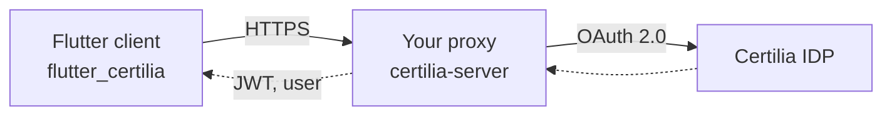
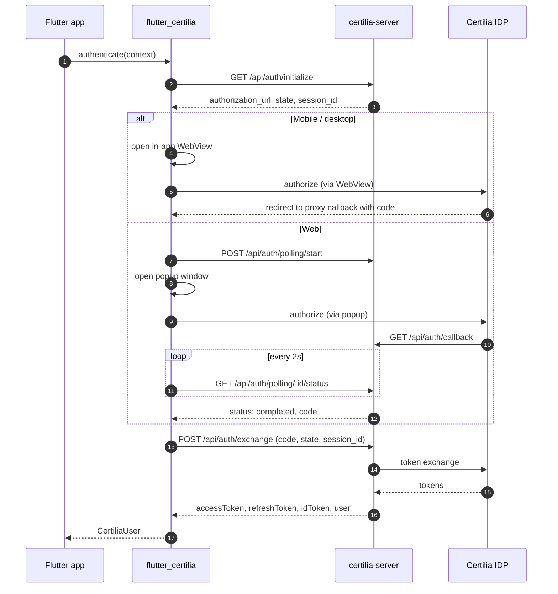

# flutter_certilia

[](https://pub.dev/packages/flutter_certilia)
[](https://opensource.org/licenses/MIT)

Flutter SDK for authenticating Croatian users with their electronic ID
card (eOsobna) via Certilia / NIAS. Works on iOS, Android, and Web.

Flutter SDK za autentifikaciju hrvatskih korisnika preko elektroničke
osobne iskaznice (eOsobna) kroz Certiliju / NIAS. Radi na iOS-u, Androidu
i Webu.

## Architecture

The SDK is **proxy-only**. The Flutter client never talks to Certilia
directly — all OAuth communication is mediated by a backend
(`certilia-server`, included in this repo) that holds the OAuth
credentials.


```mermaid
flowchart LR
    A[Flutter client<br/>flutter_certilia] -->|HTTPS| B[Your proxy<br/>certilia-server]
    B -->|OAuth 2.0| C[Certilia IDP]
    C -.-> B
    B -.->|JWT, user| A
```

Certilia only issues confidential clients: its token endpoint answers
`invalid_client` ("Unsupported Client Authentication Method!") to a code
exchange without the client secret, and the developer portal offers no
public (PKCE-only) client. The proxy keeps that secret on a server. The
app can also skip the proxy and hold the client itself; see
[Direct mode (no server)](#direct-mode-no-server). Either way the app can
receive the login redirect itself; see [Login flows](#login-flows).

The auth flow differs slightly by platform:


```mermaid
sequenceDiagram
    autonumber
    participant App as Flutter app
    participant SDK as flutter_certilia
    participant Proxy as certilia-server
    participant IDP as Certilia IDP

    App->>SDK: authenticate(context)
    SDK->>Proxy: GET /api/auth/initialize
    Proxy-->>SDK: authorization_url, state, session_id

    alt Mobile / desktop
        SDK->>SDK: open in-app WebView
        SDK->>IDP: authorize (via WebView)
        IDP-->>SDK: redirect to proxy callback with code
    else Web
        SDK->>Proxy: POST /api/auth/polling/start
        SDK->>SDK: open popup window
        SDK->>IDP: authorize (via popup)
        IDP->>Proxy: GET /api/auth/callback
        loop every 2s
            SDK->>Proxy: GET /api/auth/polling/:id/status
        end
        Proxy-->>SDK: status: completed, code
    end

    SDK->>Proxy: POST /api/auth/exchange (code, state, session_id)
    Proxy->>IDP: token exchange
    IDP-->>Proxy: tokens
    Proxy-->>SDK: accessToken, refreshToken, idToken, user
    SDK-->>App: CertiliaUser
```

## Installation

The 0.2.0 line is not yet on pub.dev. Use a `git:` or `path:` dep:

```yaml
dependencies:
  flutter_certilia:
    git:
      url: https://github.com/stepanic/flutter_certilia.git
      ref: main
```

```yaml
dependencies:
  flutter_certilia:
    path: ../flutter_certilia
```

Requirements: Dart `>=3.2.0`, Flutter `>=3.16.0`.

## Usage

The SDK has one entry point. The proxy URL is the only required value
— everything else is sensible defaults you can override.

```dart
import 'package:flutter_certilia/flutter_certilia.dart';

final certilia = await CertiliaSDK.initialize(
  serverUrl: const String.fromEnvironment(
    'CERTILIA_SERVER_URL',
    defaultValue: 'https://your-proxy.example',
  ),
  scopes: const ['openid', 'profile', 'eid', 'email', 'offline_access'],
  enableLogging: true,
);
```

Drive the auth flow. The runtime type returned by `initialize` differs
between web and mobile, but the methods you'll call are the same:

```dart
final user = await certilia.authenticate(context); // popup / WebView
final isAuthed = await certilia.checkAuthenticationStatus();
final extended = await certilia.getExtendedUserInfo();
await certilia.refreshToken();
await certilia.logout();
```

Override the proxy URL per build without touching code:

```bash
flutter run --dart-define=CERTILIA_SERVER_URL=https://your-proxy.example
```

### UI

`flutter_certilia` ships **API-only**. There are no opinionated widgets
or themes — your app keeps full control of its design system.
[`example/lib/certilia_auth/`](example/lib/certilia_auth/) is a working
reference UI (login button, authenticated view, user-info cards, theme
toggle) that you can copy-paste and adapt.

## Login flows

`CertiliaSDK.initialize(callbackUrl: ...)` chooses where Certilia sends
the browser after login. Certilia registers exactly **one callback URL
per client** and compares it exactly, so every flow with its own
callback needs its own Certilia client, and the proxy must know it
(`CERTILIA_CLIENTS`, see [`certilia-server/README.md`](certilia-server/README.md)).
The code exchange always goes through the proxy.

| `callbackUrl` | Mobile | Web |
|---|---|---|
| `null` (default) | In-app WebView watches for the proxy's `/api/auth/callback` | Popup; the app polls the proxy until the code arrives |
| Custom scheme, e.g. `hr.example.app:1/callback` | System browser (Android Auth Tab / Custom Tabs, iOS `ASWebAuthenticationSession`); the OS returns the redirect | n/a |
| https App Link / Universal Link | Same as above, redirect verified through `assetlinks.json` / `apple-app-site-association` | n/a |
| https page on the app's own origin, e.g. `https://app.example/certilia_callback.html` | n/a | Popup; [`certilia_callback.html`](example/web/certilia_callback.html) hands the result to the app over BroadcastChannel and localStorage; no polling |

One https URL can serve as both the web callback page and the Android
App Link, so a single Certilia client covers both.

### Web

- Copy [`example/web/certilia_callback.html`](example/web/certilia_callback.html)
  into your app's `web/` folder and register its full URL as the
  client's callback.
- Call `authenticate()` directly in the button's tap handler, with no
  network await before it. Safari (and every browser on iOS) blocks
  `window.open` once the page has waited on the network after the tap;
  the SDK opens the popup blank first for this reason.
- The flow works when the app page sends
  `Cross-Origin-Opener-Policy: same-origin`: the callback page does not
  use `window.opener`, which COOP cuts as soon as the popup reaches
  Certilia.

### Android

Add `flutter_web_auth_2`'s callback activity to `AndroidManifest.xml`
with an intent filter for your callback; the example app has both
variants:

```xml
<activity
    android:name="com.linusu.flutter_web_auth_2.CallbackActivity"
    android:exported="true"
    android:taskAffinity="">
  <!-- custom scheme -->
  <intent-filter>
    <action android:name="android.intent.action.VIEW" />
    <category android:name="android.intent.category.DEFAULT" />
    <category android:name="android.intent.category.BROWSABLE" />
    <data android:scheme="hr.example.app" />
  </intent-filter>
  <!-- https App Link -->
  <intent-filter android:autoVerify="true">
    <action android:name="android.intent.action.VIEW" />
    <category android:name="android.intent.category.DEFAULT" />
    <category android:name="android.intent.category.BROWSABLE" />
    <data android:scheme="https" android:host="app.example"
          android:path="/certilia_callback.html" />
  </intent-filter>
</activity>
```

For the App Link, serve `/.well-known/assetlinks.json` on the callback
host with your package name and signing certificate SHA-256.

Tested with real logins on an Android 16 emulator (Chrome 133) with both
a custom-scheme and a verified App Link callback. `preferEphemeralSession`
is not passed to the browser on Android: with it, flutter_web_auth_2 5.x
opens a plain Custom Tab on Chrome older than 141, and that tab stays on
top of the app after the redirect once the user has interacted with the
page. Keep `android:taskAffinity=""` on `MainActivity` and
`CallbackActivity` as the plugin recommends.

### iOS (native)

`ASWebAuthenticationSession` handles a custom-scheme callback without
registering the scheme in `Info.plist`. An https callback needs iOS
17.4+ and the callback host in the app's Associated Domains, with
`apple-app-site-association` served on that host. The native iOS flow
has not been tested in this repo yet; the web flow has (Safari, iOS 18).

### Registering a custom-scheme callback

The Certilia developer portal states "Only HTTPS is allowed" for the
callback URL, and its form rejects `hr.example.app://callback`. Its URL
check accepts `hr.example.app:1/callback`, which is a valid URI with the
scheme `hr.example.app`; Certilia's IDP honours it (tested with a real
login, code exchange and refresh). Registering it works around the
portal's stated rule, so prefer an https App Link / Universal Link where
you can.

## Direct mode (no server)

```dart
final certilia = await CertiliaSDK.initialize(
  direct: const CertiliaDirectClient(
    clientId: '...',
    clientSecret: '...',
  ),
  callbackUrl: 'https://app.example/certilia_callback.html', // or an App Link
);
```

The app runs the PKCE authorization code flow against `idp.certilia.com`
itself and exchanges the code with the client secret; Certilia's token
endpoint and signing keys allow cross-origin requests, so this works from
a browser too. Before accepting the ID token the SDK checks its RS256
signature against Certilia's JWKS, `iss`, `aud`, `exp` and `nonce`. The
user profile comes from the ID token: Certilia's `userinfo` endpoint only
answers requests that carry the token-binding cookie of the browser that
logged in.

**The client secret is then public.** Anyone can read it from the app
bundle or the JavaScript. What still protects your users is the exact
callback match and PKCE: Certilia sends the code only to the registered
callback, and a code is useless without the PKCE verifier of the login
that asked for it. Direct mode therefore requires an https callback (a
page on your app's origin, an Android App Link, an iOS Universal Link):
with a custom scheme, another app on the phone could receive the redirect
and, holding your secret, complete the login. Someone with the secret can
still start logins that show your service name on Certilia's page and
spend your client's login quota. Check Certilia's terms before shipping a
client secret; asking Certilia to make the client public (WSO2 supports
clients without a secret; the portal does not offer it) avoids the
question.

If your own backend needs to trust the login, send it the ID token and
verify it there against `https://idp.certilia.com/oauth2/jwks` (issuer
`https://idp.certilia.com/oauth2/token`, audience = your client id). That
needs no Certilia secret either.

Refresh: Certilia currently answers refresh requests for portal clients
with `invalid_grant` ("Persisted access token data not found"), from a
server and from a browser alike. The user logs in again when the access
token expires. (The proxy's `/api/auth/refresh` only re-signs its own JWT
and never asks Certilia.)

Tested with real logins: in Chrome with
[`example/web/serverless_login.html`](example/web/serverless_login.html)
(the same steps in plain JavaScript), and with the SDK on an Android 16
emulator with an App Link callback; no request reached a server of ours.

## Public API

| Symbol | Purpose |
|---|---|
| `CertiliaSDK.initialize(...)` | Build a platform-appropriate client |
| `CertiliaConfig` | Configuration object (proxy URL or direct client, callback URL, scopes, logging) |
| `CertiliaDirectClient` | Certilia client id/secret for [direct mode](#direct-mode-no-server) |
| `CertiliaUser` | Basic user profile (`sub`, `firstName`, `lastName`, `oib`, `email`, ...) |
| `CertiliaToken` | Access/refresh/ID tokens + expiry helpers |
| `CertiliaExtendedInfo` | Full Certilia profile — any field the upstream returned |
| `CertiliaException` | Base exception; subclasses below |
| `CertiliaAuthenticationException` | OAuth flow failed |
| `CertiliaNetworkException` | HTTP-level failure with `statusCode` |
| `CertiliaConfigurationException` | Misconfigured SDK |

Deprecated typedefs (`CertiliaSDKSimple`, `CertiliaConfigSimple`) are
kept for one minor release; they map directly to the new names and
will be removed in 1.0.0.

## Error handling

```dart
try {
  await certilia.authenticate(context);
} on CertiliaAuthenticationException catch (e) {
  // User cancelled or upstream rejected the flow
} on CertiliaNetworkException catch (e) {
  // HTTP error reaching the proxy
  print('Proxy returned ${e.statusCode}: ${e.message}');
} on CertiliaConfigurationException catch (e) {
  // SDK misconfigured
}
```

## Platform notes

- **iOS, Android**: without `callbackUrl`, auth happens in an in-app
  `WebView` and the proxy's HTTPS callback closes the loop; no
  registration in the app is needed. With `callbackUrl`, see
  [Login flows](#login-flows).
- **Web**: opens a popup. The proxy's CORS config must allow your
  origin. The SDK does **not** send custom request headers from web for
  this reason (custom headers trigger preflight).
- **Desktop**: `webview_flutter` does not ship a desktop backend; the
  SDK isn't tested on macOS/Windows/Linux. Add the appropriate
  platform plugin if you need it.

The `certilia-server` proxy that the SDK talks to is in this repo at
[`certilia-server/`](certilia-server/) — see its README for setup,
environment variables, and the supported endpoint contract.

## Troubleshooting

- **"Popup blocked"** (web): the browser refused `window.open`. On
  iOS this happens when the app awaits something (for example a network
  request) between the tap and `authenticate()`; call it directly in
  the tap handler.
- **"Authentication was cancelled"**: the user closed the popup,
  WebView or browser tab before finishing. Check the DevTools console /
  device logs.
- **`CertiliaNetworkException` on `/api/auth/initialize`** — the
  proxy URL is wrong, the proxy is down, or CORS is blocking your
  origin. `enableLogging: true` plus the browser network tab will
  point at the actual failing request.
- **Logged in but `getCurrentUser()` returns null right after hot
  restart** — was a real bug pre-0.2.0; the constructor's init
  future is now awaited before any public method runs. If you still
  see it, file an issue.

## Contributing

1. Fork the repository
2. Create your feature branch (`git checkout -b feature/amazing-feature`)
3. Commit your changes (`git commit -m 'Add some amazing feature'`)
4. Push to the branch (`git push origin feature/amazing-feature`)
5. Open a Pull Request

## License

MIT — see [LICENSE](LICENSE).

## Support

[GitHub issue tracker](https://github.com/stepanic/flutter_certilia/issues).
