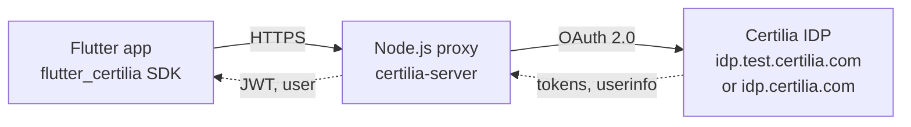

# Certilia OAuth2 Server

Node.js proxy between the flutter_certilia SDK and Certilia's IDP. It runs
the OAuth 2.0 / OpenID Connect login and holds the Certilia client secrets.

## Quick Start

### Prerequisites
- Node.js 18+
- ngrok (for local development)

### Installation
```bash
npm install
```

### Running the Server

#### TEST Environment (idp.test.certilia.com)
```bash
npm run dev:test
```

#### PRODUCTION Environment (idp.certilia.com)
```bash
npm run dev:prod
```

Both commands automatically:
- Copy the correct `.env` file
- Start server with auto-reload
- Use the appropriate Certilia endpoint

### Development with ngrok
```bash
# Terminal 1
ngrok http --url=your-domain.ngrok-free.app 3000

# Terminal 2
npm run dev:test  # or dev:prod
```

## Architecture



The proxy holds the Certilia client_id / client_secret so the Flutter
app never sees them. It reads the user's claims from the ID token, because
Certilia's production `userinfo` endpoint rejects calls from a server (see
[userinfo and token binding](#userinfo-and-token-binding)).

## API Endpoints

### Initialize Authorization
```
GET /api/auth/initialize?redirect_uri=YOUR_APP_REDIRECT_URI
```
Returns:
- `authorization_url`: URL to redirect user for authentication
- `session_id`: Session identifier for this auth flow
- `state`: CSRF protection state parameter

### Exchange Code for Tokens
```
POST /api/auth/exchange
```
Body:
```json
{
  "code": "authorization_code",
  "state": "state_from_callback",
  "session_id": "session_id_from_initialize"
}
```
Returns: Access token, refresh token, ID token, and user information

### Refresh Token
```
POST /api/auth/refresh
```
Body:
```json
{
  "refresh_token": "your_refresh_token",
  "access_token": "current_access_token"
}
```

The `access_token` field carries the previous access token so the
server can extract the upstream Certilia tokens from its JWT claims.
Older clients (pre-flutter_certilia 0.2.0) send this in the
`Authorization: Bearer` header instead; the controller accepts either.

### Get User Info
```
GET /api/auth/user
Authorization: Bearer YOUR_ACCESS_TOKEN
```

### Get Extended User Info
```
GET /api/user/extended-info
Authorization: Bearer YOUR_ACCESS_TOKEN
```
Returns the user's claims: from Certilia's `userinfo` endpoint where it
answers, otherwise from the ID token claims stored in the proxy's JWT. The
`source` field says which.

### Health Check
```
GET /api/health
```

## Environment Configuration

Create `.env.local` for TEST environment:
```env
NODE_ENV=development
PORT=3000

# Certilia OAuth Config
CERTILIA_BASE_URL=https://idp.test.certilia.com
CERTILIA_CLIENT_ID=your_client_id
CERTILIA_CLIENT_SECRET=your_client_secret
CERTILIA_REDIRECT_URI=https://your-domain.ngrok-free.app/api/auth/callback

# Security
JWT_SECRET=your_jwt_secret
SESSION_SECRET=your_session_secret

# CORS
ALLOWED_ORIGINS=http://localhost:8080,http://localhost:3000
```

Create `.env.local.production` for PRODUCTION environment with production credentials.

### Several Certilia clients (`CERTILIA_CLIENTS`)

Certilia registers exactly one callback URL per client and compares it
exactly. Each login flow with its own callback therefore needs its own
client: the proxy's `/api/auth/callback` (mobile WebView flow), a
mobile custom scheme, an https App Link or web callback page. List the
extra clients as a JSON array:

```env
CERTILIA_CLIENTS=[{"client_id":"...","client_secret":"...","redirect_uri":"hr.example.app:1/callback"},{"client_id":"...","client_secret":"...","redirect_uri":"https://app.example/certilia_callback.html"}]
```

`/api/auth/initialize` picks the client registered for the `redirect_uri`
it receives; the OAuth session remembers it and `/api/auth/exchange`
uses the same credentials. An unknown `redirect_uri` uses the default
client (`CERTILIA_CLIENT_ID`), and Certilia then rejects it unless it is
that client's callback.

### userinfo and token binding

Certilia's production `userinfo` endpoint rejects the proxy's calls with
"Valid token binding value not present". Certilia binds access tokens to
the `atbv` cookie it sets in the user's browser during login, so only a
request carrying that cookie (made from a page on `idp.certilia.com`)
succeeds. The proxy reads the user's claims from the ID token instead.
Set `SKIP_USERINFO_ENDPOINT=true` to skip the `userinfo` call altogether.
The proxy asks for the OIB in the ID token with the `claims` parameter;
Certilia's portal clients get it as `sub` instead.

## Available Scripts

| Command | Description |
|---------|-------------|
| `npm run dev:test` | Start with TEST environment |
| `npm run dev:prod` | Start with PRODUCTION environment |
| `npm run dev` | Start with current .env |
| `npm run switch:test` | Switch to TEST config (without starting) |
| `npm run switch:prod` | Switch to PROD config (without starting) |
| `npm start` | Production mode (no auto-reload) |

## Testing

### Test OAuth Flow
```bash
./test-oauth-flow.sh
```

### Test Both Environments
```bash
./test-both-environments.sh
```

### Compare Extended Info (TEST vs PROD)
```bash
./compare-extended-info.sh
```

## Security Notes

1. **Credentials** stay in environment variables, never in a committed file.
2. **PKCE**: every login sends an S256 code challenge.
3. **Login sessions**: a started login expires after 10 minutes.
4. **Access tokens**: the proxy's JWTs expire after 1 hour (`JWT_EXPIRY`).
5. **CORS**: only the origins in `ALLOWED_ORIGINS` are allowed; in
   development, every `localhost` origin too.
6. **Rate limiting**: 100 requests per IP per 15 minutes on `/api` by
   default (`RATE_LIMIT_MAX_REQUESTS`, `RATE_LIMIT_WINDOW_MS`).

## Deployment

### Google Cloud Run
```bash
./deploy-cloud-run.sh
# Enter credentials when prompted
```

### Docker
```bash
docker build -t certilia-server .
docker run -p 3000:3000 --env-file .env certilia-server
```

## License

MIT