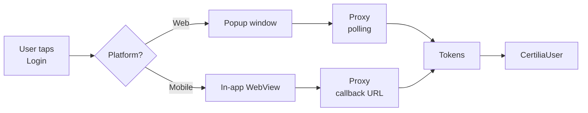

# flutter_certilia example

Reference Flutter application demonstrating `flutter_certilia` 0.2.0
against a live `certilia-server` proxy.

## What it shows

- One-button sign-in with Croatian eID (eOsobna) via the proxy
- Authenticated dashboard with basic + extended user info cards
- Token expiry countdown with manual refresh
- Logout returning to the login screen
- Session persistence across hot restart and app relaunch
- Light / dark theme toggle, Croatian / English text

The whole UI lives in `lib/certilia_auth/` and is intentionally outside
the published SDK — the SDK ships API-only so it does not impose a
design system. Copy-paste the parts you need.

## Running

```bash
# Web (fastest dev loop)
flutter run -d chrome

# Mobile
flutter run -d <device-id>
```

The proxy URL is read at build time from
`--dart-define=CERTILIA_SERVER_URL=...`. Without the flag, the app
falls back to a dev ngrok tunnel hardcoded in `lib/main.dart`:

```bash
flutter run -d chrome \
  --dart-define=CERTILIA_SERVER_URL=https://your-proxy.example
```

The proxy must be running with valid Certilia OAuth credentials. See
[`certilia-server/README.md`](../certilia-server/README.md).

## How the SDK is wired

`lib/main.dart` is a thin shell. The real integration is
`lib/certilia_auth/certilia_auth_widget.dart`:

```dart
final certilia = await CertiliaSDK.initialize(
  serverUrl: _serverUrl,
  scopes: const ['openid', 'profile', 'eid', 'email', 'offline_access'],
  enableLogging: true,
);

// later:
final user = await certilia.authenticate(context);
final extended = await certilia.getExtendedUserInfo();
await certilia.refreshToken();
await certilia.logout();
```

That's the entire surface. See [`../INTEGRATION.md`](../INTEGRATION.md)
for a step-by-step guide to dropping the SDK into a brand new app.

## Platform behavior

On web the SDK opens a popup against the proxy and polls until auth
completes. On mobile it pushes a full-screen `WebView` route. Both
close themselves on success and return a `CertiliaUser`.



## Troubleshooting

- **Login does nothing on web** — popup blocked. Allow popups for your
  origin in the browser.
- **`CertiliaNetworkException` on `/api/auth/initialize`** — proxy is
  down, URL is wrong, or proxy's CORS allow-list does not include
  your origin.
- **"Authentication was cancelled"** — user closed the popup/WebView
  before the flow finished.
- **Logged in but UI shows login screen on hot restart** — was a real
  bug in 0.1.x, fixed in 0.2.0. If still seen on 0.2.0+, file an
  issue at the [tracker](https://github.com/stepanic/flutter_certilia/issues).
