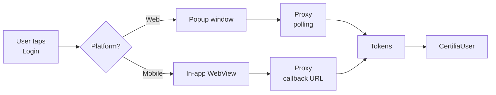

# flutter_certilia example

Flutter application that uses `flutter_certilia` 0.2.0 against a running
`certilia-server` proxy, or against Certilia directly in direct mode.

## What it shows

- Sign-in with the Croatian eID (eOsobna) from one button
- Authenticated dashboard with basic + extended user info cards
- Logout returning to the login screen
- Session persistence across hot restart and app relaunch
- Light / dark theme toggle, Croatian / English text

The whole UI is in `lib/certilia_auth/`. The SDK itself contains no UI,
so it does not impose a design system on your app; copy the parts you
need.

## Running

```bash
# Web (fastest dev loop)
flutter run -d chrome

# Mobile
flutter run -d <device-id>
```

The proxy URL is read at build time from
`--dart-define=CERTILIA_SERVER_URL=...`. Without the flag, the app
falls back to a dev ngrok tunnel hardcoded in `lib/main.dart`:

```bash
flutter run -d chrome \
  --dart-define=CERTILIA_SERVER_URL=https://your-proxy.example
```

`--dart-define=CERTILIA_CALLBACK_URL=...` selects the login flow that
receives the redirect in the app (see "Login flows" in the root README).
`CERTILIA_CLIENT_ID` and `CERTILIA_CLIENT_SECRET` switch to direct mode,
which needs an https `CERTILIA_CALLBACK_URL`.

The proxy must be running with valid Certilia OAuth credentials. See
[`certilia-server/README.md`](../certilia-server/README.md).

## How the SDK is wired

`lib/main.dart` only reads the build settings and builds the widget.
The SDK calls are in `lib/certilia_auth/certilia_auth_widget.dart`:

```dart
final certilia = await CertiliaSDK.initialize(
  serverUrl: _serverUrl,
  scopes: const ['openid', 'profile', 'eid', 'email', 'offline_access'],
  enableLogging: true,
);

// later:
final user = await certilia.authenticate(context);
final extended = await certilia.getExtendedUserInfo();
await certilia.refreshToken();
await certilia.logout();
```

Those are all the SDK calls the example makes. See
[`../INTEGRATION.md`](../INTEGRATION.md) for adding the SDK to a new app
step by step.

## Platform behavior

Without `CERTILIA_CALLBACK_URL`, the SDK opens a popup on web and polls
the proxy until the login completes; on mobile it pushes a full-screen
`WebView` route. Both close themselves on success and return a
`CertiliaUser`. With a callback URL, web uses a popup and the callback
page, and mobile uses the system browser.


```mermaid
flowchart LR
    A[User taps<br/>Login] --> B{Platform?}
    B -->|Web| C[Popup window]
    B -->|Mobile| D[In-app WebView]
    C --> E[Proxy<br/>polling]
    D --> F[Proxy<br/>callback URL]
    E --> G[Tokens]
    F --> G
    G --> H[CertiliaUser]
```

## Troubleshooting

- **Login does nothing on web**: popup blocked. Allow popups for your
  origin in the browser.
- **`CertiliaNetworkException` on `/api/auth/initialize`**: proxy is
  down, URL is wrong, or proxy's CORS allow-list does not include
  your origin.
- **"Authentication was cancelled"**: user closed the popup/WebView
  before the flow finished.
- **Logged in but the UI shows the login screen after a hot restart**:
  file an issue at the
  [tracker](https://github.com/stepanic/flutter_certilia/issues).
